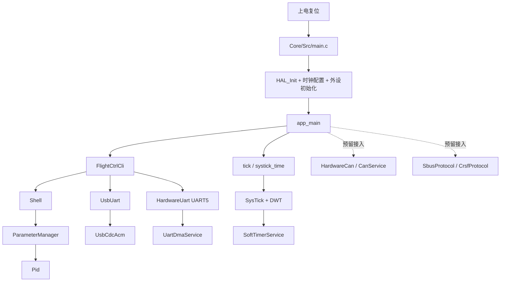

<div align="center">

# iFly_Ctrl

<p><strong>基于 STM32F405 的飞控控制台与底层通信框架</strong></p>

<p>
  以 STM32CubeMX 生成的 HAL 工程为底座，叠加 C++17 应用层、USB CDC / UART DMA / CAN 传输抽象、
  交互式 Shell、参数系统、PID 控制器，以及 SBUS / CRSF 协议解析能力。
</p>

<p>
  
  
  
  
</p>

</div>

## 项目概览

`iFly_Ctrl` 是一个面向嵌入式飞控方向的底层框架工程。它并不是一个“已经接好全部传感器、姿态解算与电机混控”的成品飞控，而是一个把下面这些关键能力先搭起来的工程底座：

- STM32F405 单片机启动、时钟、GPIO、DMA、UART、CAN、USB OTG FS 初始化
- C / C++ 混合工程组织方式
- 基于 `USB CDC` 和 `UART DMA` 的统一串口抽象
- 可登录、可调参、可执行函数调用的交互式 CLI
- 可运行时热更新的参数系统
- 带限幅、导数滤波和抗积分饱和的 PID 控制器
- SBUS / CRSF 遥控协议编码与解析能力
- 纳秒级时间基准与轻量级软定时器

> [!IMPORTANT]
> 当前主循环真正接通的业务链路，是 `USB/UART CLI + Shell + ParameterManager + PID`。
> `CAN`、`SBUS`、`CRSF`、`SoftTimer` 等模块已经具备独立实现，但还没有在 `iFly/app_main.cpp` 中串成完整飞控闭环。

## 适合阅读这份仓库的人

- 想学习 `STM32CubeMX + HAL + CMake` 混合工程组织方式的开发者
- 想把 `C` 生成工程逐步升级成 `C++` 业务架构的嵌入式工程师
- 想看 `UART DMA / USB CDC / CAN` 如何做统一抽象的人
- 想实现一个轻量级嵌入式 CLI、参数系统和 PID 验证环境的人
- 想基于此工程继续扩展成完整飞控系统的人

## 当前工程完成度

| 模块 | 当前状态 | 说明 |
| --- | --- | --- |
| CubeMX 底座 | 已接入 | `Core/`、`Drivers/`、`.ioc` 负责芯片与外设初始化 |
| CMake 构建链 | 已接入 | 支持 `Debug` / `Release` 预设 |
| USB CDC CLI | 已接入 | 默认 CLI 传输通道 |
| UART5 CLI | 已接入 | 备用 CLI 传输通道，可运行时切换 |
| Shell | 已接入 | 登录、提示符、函数调用、参数读写都可用 |
| ParameterManager | 已接入 | 浮点、无符号整型、布尔、回调参数统一管理 |
| PID | 已接入 | 提供 CLI 下在线验证与热调参 |
| Tick / SysTick / DWT | 已接入 | 提供 `ms/us/ns` 时间接口 |
| SoftTimer | 已实现，暂未接入主业务 | 已在 `SysTick_Handler` 中维护 tick |
| UART DMA Service | 已接入 | 多串口统一 DMA 收发底层 |
| USB CDC Stack | 已接入 | 自己实现了 CDC ACM 设备层 |
| CAN Service | 已实现，暂未接入主业务 | 当前 CubeMX 配置为 `CAN_MODE_LOOPBACK` |
| SBUS / CRSF | 已实现，暂未接入主业务 | 提供协议编解码和统计信息 |

## 仓库结构

```text
iFly_Ctrl/
├─ Core/                         # STM32CubeMX 生成的应用层 C 代码
│  ├─ Inc/
│  └─ Src/
├─ Drivers/                      # HAL / CMSIS 驱动
├─ cmake/                        # 工具链与 CubeMX-CMake 组合脚本
├─ iFly/                         # C++ 业务层与基础库
│  ├─ app_main.cpp               # 上层主入口
│  ├─ app/
│  │  ├─ cli/                    # FlightCtrlCli 与终端逻辑
│  │  ├─ ctrl/                   # PID 控制器
│  │  ├─ observer/               # 观察者相关占位
│  │  ├─ paramete/               # 参数管理器（目录名按仓库现状保留）
│  │  ├─ proto/
│  │  │  ├─ crsf/                # CRSF 协议解析与编码
│  │  │  └─ sbus/                # SBUS 协议解析与编码
│  │  └─ tick/                   # 时间接口薄封装
│  ├─ dev/
│  │  ├─ can_dev/                # CAN 设备封装
│  │  ├─ uart_dev/               # UART 设备封装
│  │  ├─ usb_dev/                # USB CDC 设备封装
│  │  └─ serial_io_base.hpp      # 统一字节流抽象
│  └─ lib/
│     ├─ can/                    # CAN 运行时服务
│     ├─ double_buffer/          # 双缓冲工具
│     ├─ freelock_queue/         # 无锁队列
│     ├─ shell/                  # CLI Shell
│     ├─ soft_timer/             # 软定时器
│     ├─ systick_timer/          # DWT + SysTick 时间基准
│     ├─ uart/                   # UART DMA 服务
│     └─ usb_cdc/                # USB CDC ACM 协议层
├─ CMakeLists.txt                # 项目总构建入口
├─ CMakePresets.json             # Debug / Release 构建预设
├─ iFly_Ctrl.ioc                 # STM32CubeMX 工程文件
├─ STM32F405XX_FLASH.ld          # 链接脚本
└─ startup_stm32f405xx.s         # 启动文件
```

## 系统架构总览



这个架构体现了几个非常重要的工程思想：

- 底层初始化仍由 CubeMX 维护，避免手写大量寄存器初始化代码
- 上层业务迁移到 `iFly/` 目录中的 C++ 模块，避免后续被 CubeMX 覆盖
- 传输层通过统一抽象隔离 USB、UART、CAN 的细节差异
- 数据收发尽量通过无锁队列和双缓冲实现，降低阻塞风险
- 协议层、控制层、交互层彼此拆开，后续接入完整飞控闭环时改动更可控

## 启动流程

### 1. `main.c` 负责硬件启动

`Core/Src/main.c` 中的 `main()` 会按 STM32 工程标准流程执行：

1. `HAL_Init()`
2. `SystemClock_Config()`
3. 初始化 GPIO、DMA、USB OTG FS、6 路 UART、CAN1
4. 调用 `app_main()`

这样做的价值在于：硬件初始化继续交给 CubeMX 维护，业务初始化则从 `app_main()` 开始进入 C++ 世界。

### 2. `app_main()` 负责业务接线

`iFly/app_main.cpp` 做了三件核心事情：

- 构造 `HardwareUart(UART5)` 和 `UsbUart`
- 构造 `FlightCtrlCli`
- 把 `usb` 和 `uart5` 两个传输通道注册进 CLI，并默认选择 `usb`

随后程序进入一个极简主循环：

```cpp
while (1) {
  g_flight_ctrl_cli.Poll();
  iFly::tick::DelayMs(1U);
}
```

也就是说，当前仓库最真实、最明确的主业务就是“跑一个稳定可交互的飞控控制台”。

## 硬件资源与当前映射

### UART

| 端口 | 波特率 | 当前用途 |
| --- | --- | --- |
| `UART4` | `500000` | 已初始化，业务未直接接入 |
| `UART5` | `1000000` | 已接入 CLI 传输通道 |
| `USART1` | `500000` | 已初始化，业务未直接接入 |
| `USART2` | `500000` | 已初始化，业务未直接接入 |
| `USART3` | `500000` | 已初始化，业务未直接接入 |
| `USART6` | `500000` | 已初始化，业务未直接接入 |

### USB

| 外设 | 引脚 | 当前用途 |
| --- | --- | --- |
| `USB_OTG_FS` | `PA11/PA12` | 默认 CLI 通道，设备枚举为 USB CDC ACM |

### CAN

| 外设 | 引脚 | 当前模式 | 当前用途 |
| --- | --- | --- | --- |
| `CAN1` | `PB8/PB9` | `CAN_MODE_LOOPBACK` | 已具备服务层，但当前未接入主循环 |

## 核心模块详解

### 1. C / C++ 混合工程边界

这是整个仓库最值得借鉴的地方之一。

- `Core/` 与 `Drivers/` 保持 CubeMX 生成风格
- `iFly/` 目录承载全部可演进业务代码
- `app_main.h` 提供 `extern "C"` 边界，使 `main.c` 可以调用 `app_main()`

这种设计兼顾了两个目标：

- 不破坏 CubeMX 工作流
- 不让上层业务长期困在纯 C + 大文件 + 难拆分的结构里

如果你后续要把这个工程继续扩展成姿态解算、遥控接入、电机控制、任务调度完整飞控，这个边界设计会非常省事。

### 2. Shell 与 CLI 交互层

CLI 相关核心在两个类：

- `iFly/lib/shell/shell.*`
- `iFly/app/cli/flight_ctrl_cli.*`

`Shell` 提供的是通用终端框架，负责：

- 登录会话状态管理
- 激活键检测
- 密码验证
- 输入行编辑
- 内建命令解析
- 参数与函数注册
- 文本输出

`FlightCtrlCli` 则是飞控场景下的业务包装，负责：

- 定义 CLI banner、提示符和登录策略
- 注册参数
- 注册函数
- 绑定传输设备
- 驱动开场动画

当前 CLI 有几个非常直观的特性：

- 连接建立后先显示激活提示，需要按空格进入终端
- 随后要求输入密码，默认密码是 `ifly`
- 登录成功后进入 `iFly> ` 提示符
- CLI 默认走 `USB CDC`
- 可通过命令切换到 `UART5`

### 3. Shell 支持的命令模型

`Shell` 不仅有单一命令表，而是拆成三类能力：

- `Command`：普通命令
- `Function`：显式调用型函数
- `Parameter`：可读写参数

内建命令包括：

- `help`
- `clear`
- `logout`
- `passwd`
- `func list`
- `func call <name> [args...]`
- `call <name> [args...]`
- `param list`
- `param get <name>`
- `param set <name> <value>`
- `get <name>`
- `set <name> <value>`
- `params`

这种设计非常适合嵌入式调试，因为它天然支持“看状态、改参数、执行动作”三类操作。

### 4. FlightCtrlCli 的业务注册内容

当前 `FlightCtrlCli` 注册了几类参数：

- `pid.kp / pid.ki / pid.kd / pid.kff`
- `pid.i_min / pid.i_max`
- `pid.out_min / pid.out_max`
- `pid.d_cutoff_hz`
- `sys.loop_hz`
- `sys.arm_locked`
- `sys.transport`
- `sys.uptime_ms`

以及几类函数：

- `status`
- `sys.reboot`
- `pid.reset`
- `pid.sample <setpoint> <measurement> <dt_ms>`
- `transport.list`
- `transport.use <name>`

这说明当前 CLI 已经不只是“串口打印调试”，而是一个具备在线配置和在线验证能力的调试界面。

### 5. ParameterManager 的设计价值

`iFly/app/paramete/parameter_manager.*` 的核心目标，是把业务变量统一映射为 Shell 参数，而不是为每个参数重复写 getter/setter。

它支持四类参数规格：

- `FloatSpec`
- `U32Spec`
- `BoolSpec`
- `CallbackSpec`

这套设计有几个优点：

- 不依赖动态反射
- 不需要堆上分配
- 参数直接绑定业务变量地址，路径非常短
- 能在参数变化后触发 `on_updated` 回调

例如 PID 参数更新后，会立即触发 `OnPidParameterUpdated()`，重新把最新配置同步到 `Pid` 实例中。也就是说，CLI 改的不是“显示层副本”，而是控制器真正使用的运行时参数。

### 6. PID 控制器实现

`iFly/app/ctrl/pid.*` 实现的是一个相当完整的通用 PID：

- 支持 `P / I / D / FeedForward`
- 支持积分限幅
- 支持输出限幅
- 支持导数项低通滤波
- 支持 `OnError` / `OnMeasurement` / `OnExternalMeasurementRate` 三种导数模式
- 支持非法数值防护
- 支持 `dt` 下限与上限修正
- 支持抗积分饱和逻辑

当前 CLI 中的 `pid.sample` 命令，本质上就是一个在线 PID 验证器。你可以直接在终端里测试某组参数下的一次控制输出结果，而不必先接入整套飞控闭环。

### 7. 统一传输抽象：`SerialIoBase`

`iFly/dev/serial_io_base.hpp` 是贯穿工程的关键抽象层。

它把上层真正关心的能力统一为：

- `Init()`
- `Write()`
- `Read()`
- `TxFree() / TxUsed()`
- `RxDropped()`
- `IsConnected()`

并且把“统一接收队列”直接做成基类的一部分。

这意味着对于上层业务来说：

- USB CDC 看起来像串口
- UART DMA 看起来像串口
- CAN 也被适配成了类似统一 IO 接口

这让 `FlightCtrlCli` 可以只关心“绑定某个传输通道”，而无需知道底层究竟是 USB 还是 UART。

### 8. 无锁队列：整个数据流的缓冲核心

`iFly/lib/freelock_queue/lock_free_queue.*` 提供了字节级无锁队列基础设施。

它的使用思路是：

- RX 数据先进队列，再由上层轮询取走
- TX 数据先入底层队列，再由底层服务分批发出

这种方式特别适合中断与主循环并存的嵌入式场景，因为它能把：

- 中断侧“尽快收、尽快放”
- 主循环“按自己节奏处理”

这两个需求解耦开。

### 9. 双缓冲设计：为发送通路降阻塞

`iFly/lib/double_buffer/double_buffer.hpp` 被 UART、USB、CAN 三个发送链路复用。

基本思想是：

- `active` 槽：当前已经交给硬件发送的那一包
- `inactive` 槽：下一包待发送数据

好处很明确：

- 当前包在发时，下一包可以提前装载
- DMA 或 USB IN 端点只面对稳定缓冲区
- 上层写入数据时不需要直接等待硬件空闲

这是一种非常适合实时嵌入式通信通路的工程手法。

### 10. UART DMA 服务

`iFly/lib/uart/uart_dma.*` 实现了多串口统一管理的 DMA 收发服务。

它做的不是简单调用一次 `HAL_UART_Transmit_DMA()`，而是组织成完整运行时服务：

- 把逻辑串口号映射到 `UART_HandleTypeDef`
- 维护每个端口自己的 TX 队列
- 维护 TX 双缓冲
- 使用 `HAL_UARTEx_ReceiveToIdle_DMA()` 做 RX
- 在 HAL 回调中把 RX 数据推入上层队列
- 在 TX 完成回调中继续推进下一包发送

因此 UART 数据链路实际上是：

```text
上层 Write()
-> TX 无锁队列
-> TX 双缓冲
-> HAL_UART_Transmit_DMA()
```

RX 则是：

```text
DMA 环形缓冲区
-> HAL_UARTEx_RxEventCallback()
-> 上层统一 RX 队列
```

这比直接在业务代码里堆 HAL 调用要稳定得多，也更容易扩展到多串口并发。

### 11. USB CDC ACM 协议层

`iFly/lib/usb_cdc/usb_cdc.*` 是这个仓库里最值得细看的模块之一。

它不是简单依赖现成中间件，而是自己实现了一套轻量级 `USB CDC ACM` 设备层，负责：

- 设备描述符与配置描述符
- 控制端点 EP0 的标准请求处理
- CDC 类请求处理
- 数据 IN/OUT 端点收发
- 上层 RX 队列挂接
- TX 队列与双缓冲驱动

这意味着工程对 USB 通信路径的掌控力很高，后续如果要做：

- 自定义控制命令
- 更复杂的数据协议
- 更严格的端点行为控制

都会比“黑盒式引用 USB 组件”更灵活。

当前 USB 传输链路可以概括为：

```text
CLI / 上层写入
-> UsbCdcAcm TX 队列
-> USB IN 双缓冲
-> PCD 发送

USB OUT 端点
-> USB OUT 双缓冲
-> 上层 RX 队列
-> Shell / CLI 读取
```

### 12. CAN 运行时服务

`iFly/lib/can/can.*` 和 `iFly/dev/can_dev/hardware_can.*` 提供了统一的 CAN 服务。

设计重点有两个：

1. CAN 本质是“按帧”通信，不是字节流
2. 但为了和 `SerialIoBase` 风格兼容，它把每一帧包装成固定大小的 `CanFramePacket`

这样做的好处是：

- 上层仍能复用统一 IO 风格接口
- 队列中搬运的始终是完整帧
- 不会丢掉 CAN 帧边界

当前 CAN 的特点需要特别注意：

- CubeMX 只初始化了 `CAN1`
- `CAN1` 目前被配置成了 `CAN_MODE_LOOPBACK`
- 这说明当前 CAN 更偏向框架验证和自测，而不是外部总线实战接入

### 13. SBUS 与 CRSF 协议模块

`iFly/app/proto/sbus/*` 和 `iFly/app/proto/crsf/*` 已经各自实现了完整的编解码器。

#### SBUS

- 固定 `25` 字节帧
- 支持 16 路模拟通道
- 支持 `channel17/channel18`
- 支持 `frameLost/failsafe`
- 具备重同步统计

#### CRSF

- 支持普通帧与扩展帧
- 支持 CRC 校验
- 支持 `RC Channels Packed`
- 具备解码统计、丢帧统计、重同步统计

这两个模块当前的定位，是“协议能力已准备好，等待未来接入具体接收机数据路径和控制逻辑”。

### 14. 时间系统：HAL Tick + DWT

时间系统由两层组成：

- `iFly/lib/systick_timer/systick_time.*`
- `iFly/app/tick/tick.*`

它的策略是：

- `ms` 时间使用 `HAL_GetTick()`
- `us/ns` 时间使用 `DWT->CYCCNT`
- 通过 `SysTick_Handler` 持续维护 DWT 回绕高位

这让工程同时拥有：

- 简单稳定的毫秒级延时
- 更高分辨率的微秒/纳秒时间戳

`FlightCtrlCli` 中的打字机动画、转圈动画和进度条，就是靠 `tick::NowNs()` 和非阻塞延时对象实现的。

### 15. SoftTimer：轻量级非抢占调度器

`iFly/lib/soft_timer/soft_timer.*` 实现了一个小型软定时器服务，特点是：

- `SysTick` 中断里只做 1ms 计数递增
- 真正任务回调放在主循环的 `Dispatch()` 中执行
- 支持优先级
- 支持周期任务与单次任务
- 支持运行中删除
- 支持当前任务主动申请下一次唤醒延迟

这套定时器当前虽然还没进 `app_main.cpp` 主流程，但已经具备接入条件。后续如果加入遥控接收、姿态更新、心跳上报、状态灯等周期任务，这套机制会很有价值。

## 为什么这个工程适合作为飞控底座

相比一上来就把“姿态解算、电机混控、遥控协议、地面站协议”全堆进一个工程，这个仓库先把几个更关键的基础设施搭好了：

- 可持续维护的工程分层
- 可复用的传输通道抽象
- 可在线调试的 CLI
- 可热更新的参数系统
- 可验证的 PID 基础组件
- 可扩展的协议模块
- 可扩展的时间与调度框架

这会让后续真正加飞控业务时，代码结构更稳，而不是越写越散。

## CLI 使用示例

### 1. 登录终端

1. 连接开发板到主机
2. 打开 USB CDC 串口
3. 按空格进入终端
4. 输入密码 `ifly`

### 2. 查看帮助

```text
help
help params
func list
params
```

### 3. 查看状态

```text
call status
```

### 4. 在线调 PID 参数

```text
get pid.kp
set pid.kp 1.2
set pid.ki 0.15
set pid.kd 0.03
```

### 5. 单次验证 PID 输出

```text
call pid.sample 100 92 1
```

这个命令表示：

- 设定值 `100`
- 测量值 `92`
- 采样周期 `1 ms`

终端会返回本次 PID 输出及 `P/I/D/FF` 分量。

### 6. 切换传输通道

```text
call transport.list
call transport.use uart5
```

切换后，CLI 会重新绑定新的 IO 设备，需要在对应端口重新连接。

## 构建方式

### 工具链要求

要在本地编译此工程，建议准备以下环境：

- `CMake 3.22+`
- `Ninja`
- `GNU Arm Embedded Toolchain`
- `arm-none-eabi-gcc / g++ / objcopy / size` 已加入 `PATH`

### 构建预设

仓库通过 `CMakePresets.json` 提供两个预设：

- `Debug`
- `Release`

### 典型构建命令

```bash
cmake --preset Debug
cmake --build --preset Debug
```

成功后，主要产物会位于：

```text
build/Debug/
```

核心可执行文件为：

```text
iFly_Ctrl.elf
```

链接脚本为：

```text
STM32F405XX_FLASH.ld
```

### 关于 CubeMX

如果你要调整引脚、外设、DMA 或时钟配置，建议继续以 `iFly_Ctrl.ioc` 为入口，用 STM32CubeMX 维护底层初始化代码，然后把业务逻辑继续放在 `iFly/` 目录中，避免手改生成文件后被覆盖。

## 后续扩展建议

如果你要把这个工程继续推进成完整飞控，优先级建议如下：

1. 把 `SoftTimerService` 接入主循环调度
2. 把 `CRSF` 或 `SBUS` 接入某一路 UART 实际数据源
3. 增加姿态状态、遥控状态、电机输出等运行时参数与状态对象
4. 在 CLI 中加入任务状态、遥控输入和输出调试命令
5. 接入 IMU、姿态解算和控制闭环
6. 把 `CAN` 从 loopback 模式切换到实际总线模式

## 参与文档编写

本仓库已经单独提供文档协作说明：

- [CONTRIBUTING.md](CONTRIBUTING.md)

你可以在其中看到：

- 文档应该写什么
- 如何保证文档和代码一致
- 推荐的章节结构
- PR 自检清单

如果你想继续完善这份 README，最推荐的方向是：

- 为 `USB CDC`、`UART DMA`、`CAN` 增加更细的时序图
- 为 `SBUS / CRSF` 增加协议示意图和测试样例
- 补充“如何把该工程接成完整飞控”的实践章节

## 总结

`iFly_Ctrl` 的真正价值，不在于它已经把飞控所有功能写完，而在于它已经把一个飞控工程最容易失控的几部分先做对了：

- 工程分层
- 传输抽象
- 调试入口
- 参数热更新
- 控制器基础件
- 时间与调度底座

如果你打算从零演进一个可维护的飞控工程，这个仓库是一个很好的起点。
